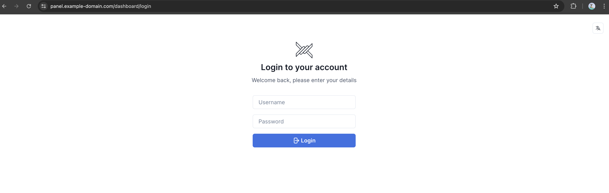
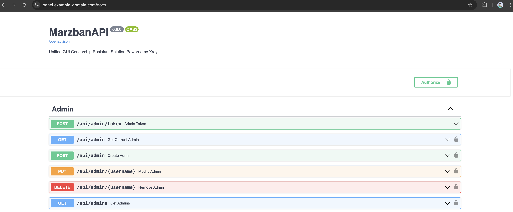
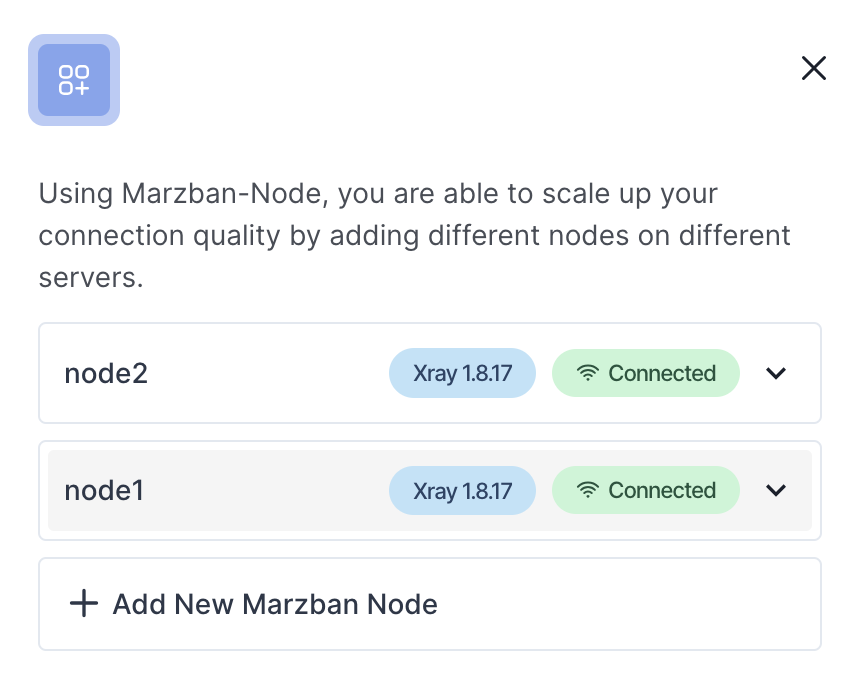
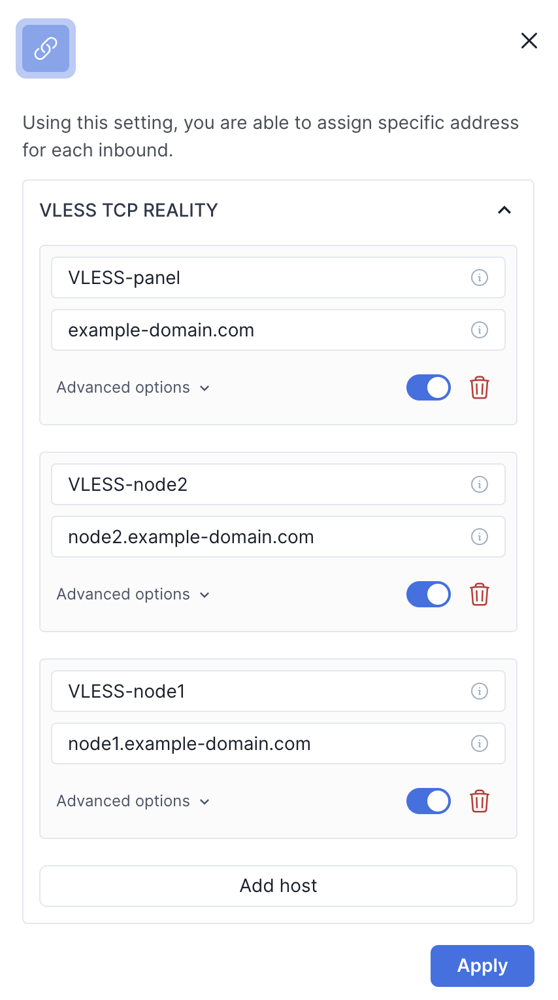
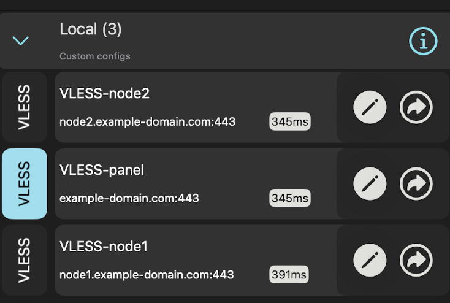

## FAQ

[[_TOC_]]

## How do I access the control panel?
After running the playbook, the Marzban panel is available at the path specified in the inventory `marzban_domain: example-domain.com`



Login credentials are specified in the variables:
```yaml
marzban_panel_login: "admin"
marzban_panel_password: "panelpassword"
```


## I want to enable the documentation available at /doc, how do I do that?
Set the variable `marzban_docs` to `true` before deployment



## I want to configure additional nodes for load balancing, how do I do that?
First, you need to fill in the inventory file [hosts.yml](../hosts.yml.example)

Let's add two new nodes and a group of hosts `marzban_nodes` to it
```yaml
        marzban_nodes:
          hosts:
            node1:
              ansible_host: 88.43.44.22
              ansible_port: 22
              marzban_roles:
                - node
            node2:
              ansible_host: 33.167.12.8
              ansible_port: 22
              marzban_roles:
                - node
```

Next, configure additional CNAME records in your DNS to have records for the two new nodes:
- `node1.{{ marzban_domain }}`
- `node2.{{ marzban_domain }}`

After this, run the playbook

```shell
ansible-playbook marzban-deploy.yml
```







## I want to use warp. What do I need to configure?
Set the variable `marzban_warp` to `true` before deployment

Fill in the destination list in the variable `marzban_warp_domains`

```yaml
# Traffic filter settings through Cloudflare
marzban_warp_domains:
  - "geosite:openai"
  - "domain:ipinfo.io"
  - "domain:iplocation.net"
  - "domain:spotify.com"
  - "domain:linkedin.com"
```